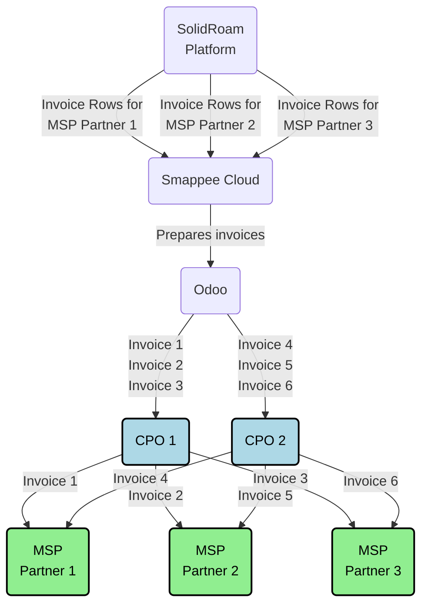

# Monthly Invoice Generation

```mermaid
graph TD
    P1(MSP<br/>Partner 1)
    P2(MSP<br/>Partner 2)
    P3(MSP<br/>Partner 3)
    SR(SolidRoam<br/>Platform) -->|Invoice Rows for<br/>MSP Partner 1| CLOUD(Smappee Cloud)
    SR(SolidRoam<br/>Platform) -->|Invoice Rows for<br/>MSP Partner 2| CLOUD
    SR(SolidRoam<br/>Platform) -->|Invoice Rows for<br/>MSP Partner 3| CLOUD

    CLOUD -- Prepares invoices --> ERP(Odoo)
    
    ERP -->|Invoice 1<br/>Invoice 2<br/>Invoice 3| C1(CPO 1)
    ERP -->|Invoice 4<br/>Invoice 5<br/>Invoice 6| C2(CPO 2)
    
    C1 -->|Invoice 1| P1
    C1 -->|Invoice 2| P2
    C1 -->|Invoice 3| P3
    C2 -->|Invoice 4| P1
    C2 -->|Invoice 5| P2
    C2 -->|Invoice 6| P3
    
    style C1 fill:lightblue,stroke:black,stroke-width:2px,color:black
    style C2 fill:lightblue,stroke:black,stroke-width:2px,color:black
    style P1 fill:lightgreen,stroke:black,stroke-width:2px,color:black
    style P2 fill:lightgreen,stroke:black,stroke-width:2px,color:black
    style P3 fill:lightgreen,stroke:black,stroke-width:2px,color:black

```
