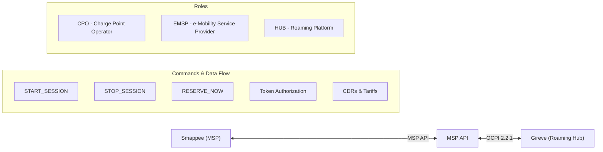
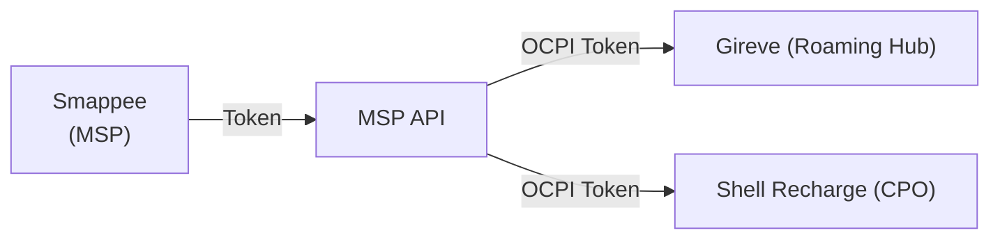
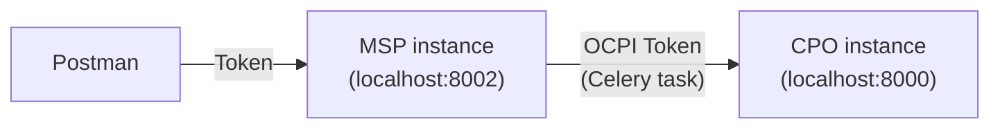
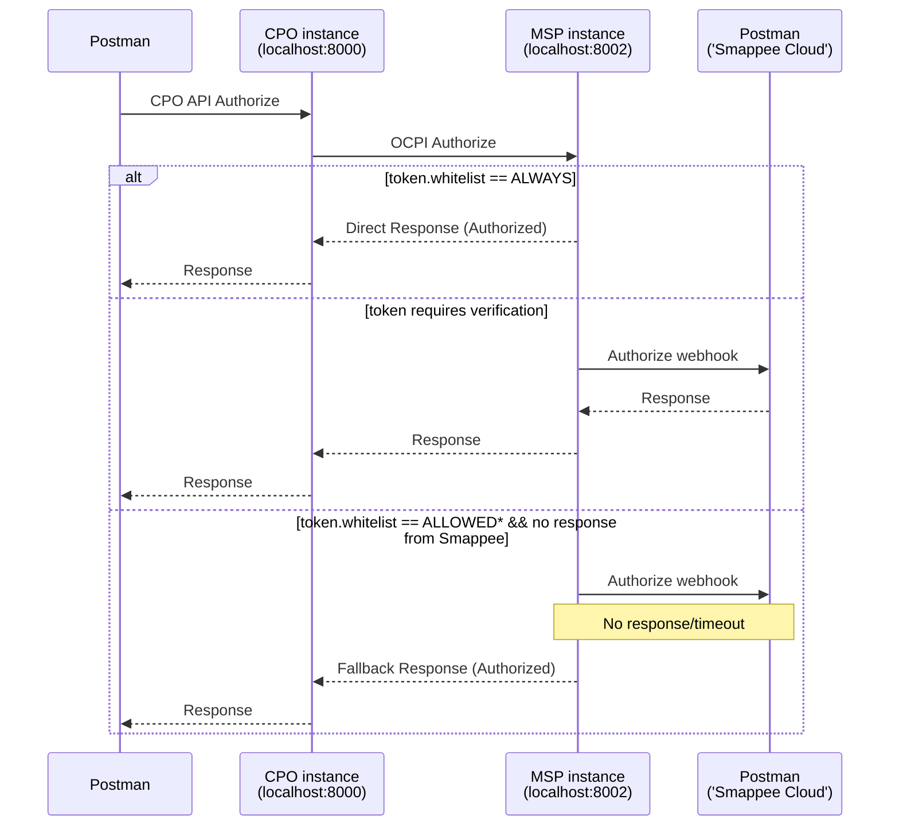
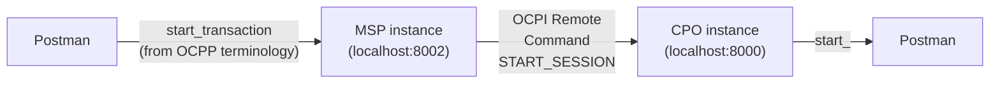

```mermaid
graph LR
    Smappee["Smappee (MSP)"]
    MSP["MSP API"]
    Gireve["Gireve (Roaming Hub)"]
    
    Smappee <--> |MSP API| MSP
    MSP <--> |OCPI 2.2.1| Gireve
    
    subgraph "Commands & Data Flow"
    cmd1["START_SESSION"]
    cmd2["STOP_SESSION"]
    cmd3["RESERVE_NOW"]
    cmd4["Token Authorization"]
    cmd5["CDRs & Tariffs"]
    end
    
    subgraph "Roles"
    role1["CPO - Charge Point Operator"]
    role2["EMSP - e-Mobility Service Provider"]
    role3["HUB - Roaming Platform"]
    end

```

## MSP API process flow

```mermaid
graph LR
    Smappee["Smappee<br>(MSP)"]
    MSP["MSP API"]
    Gireve["Gireve (Roaming Hub)"]
    Shell["Shell Recharge (CPO)"]
    
    Smappee --> |Token| MSP
    MSP --> |OCPI Token| Gireve
    MSP --> |OCPI Token| Shell
    

```
# Local test network architeture

## PUT Token

```mermaid
graph LR
    Smappee["Postman"]
    MSP["MSP instance<br>(localhost:8002)"]
    cpo["CPO instance<br>(localhost:8000)"]

    Smappee --> |Token| MSP
    MSP --> |"OCPI Token<br>(Celery task)"| cpo
```

## Authorize Token

```mermaid
sequenceDiagram
    participant Smappee2 as Postman
    participant cpo as CPO instance<br>(localhost:8000)
    participant MSP as MSP instance<br>(localhost:8002)
    participant Smappee as Postman<br>('Smappee Cloud')
    
    Smappee2->>cpo: CPO API Authorize
    cpo->>MSP: OCPI Authorize
    
    alt token.whitelist == ALWAYS
        MSP-->>cpo: Direct Response (Authorized)
        cpo-->>Smappee2: Response
    else token requires verification
        MSP->>Smappee: Authorize webhook
        Smappee-->>MSP: Response
        MSP-->>cpo: Response
        cpo-->>Smappee2: Response
    else token.whitelist == ALLOWED* && no response from Smappee
        MSP->>Smappee: Authorize webhook
        Note over MSP,Smappee: No response/timeout
        MSP-->>cpo: Fallback Response (Authorized)
        cpo-->>Smappee2: Response
    end
```

## Local remote-command network architecture

```mermaid
graph LR
    Smappee["Postman"]
    Smappee2["Postman"]
    MSP["MSP instance<br>(localhost:8002)"]
    cpo["CPO instance<br>(localhost:8000)"]
    
    Smappee -- start_transaction<br>(from OCPP terminology) --> MSP
    MSP --> |OCPI Remote<br>Command<br>START_SESSION| cpo
    cpo -- start_ --> Smappee2
```
