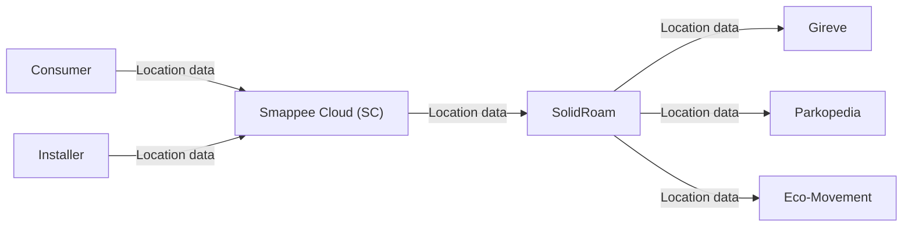
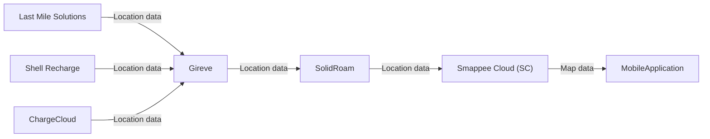

#### Smappee as CPO

```mermaid
graph LR
    %% Data sources
    Consumer["Consumer"]
    Installer["Installer"]
    
    %% Central systems
    SC["Smappee Cloud (SC)"]
    SR["SolidRoam"]
    
    %% Data consumers
    Gireve["Gireve"]
    Parkopedia["Parkopedia"]
    EcoMovement["Eco-Movement"]
    
    
    %% Forward data flow
    Consumer -->|"Location data"| SC
    Installer -->|"Location data"| SC
    SC -->|"Location data"| SR
    SR -->|"Location data"| Gireve
    SR -->|"Location data"| Parkopedia
    SR -->|"Location data"| EcoMovement
    

    
    %% Style
    class SC,SR primary
    class Gireve,Parkopedia,EcoMovement,Porsche,Shell secondary
```

#### Smappee as eMSP

```mermaid
graph LR
    
    %% Central systems
    SC["Smappee Cloud (SC)"]
    SR["SolidRoam"]
    
    %% Data consumers
    Gireve["Gireve"]
    
    %% External systems
    LastMileSolutions["Last Mile Solutions"]
    ChargeCloud["ChargeCloud"]
    Shell["Shell Recharge"]
    
    
    %% Reverse data flow
    LastMileSolutions -->|"Location data"| Gireve
    Shell -->|"Location data"| Gireve
    ChargeCloud -->|"Location data"| Gireve
    Gireve -->|"Location data"| SR
    SR -->|"Location data"| SC
    SC -- Map data --> MobileApplication
    %% Style
    class SC,SR primary
    class Gireve,Parkopedia,EcoMovement,Porsche,Shell secondary
```
