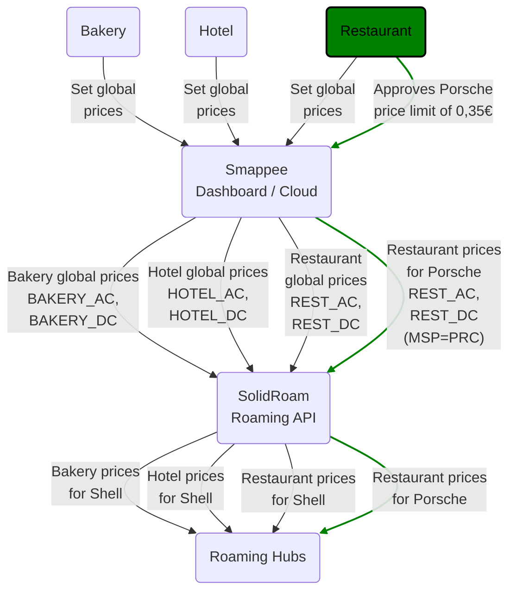

# Pricing Flow

With MSP specific pricing

```mermaid
graph TD
    Bakery(Bakery) -- Set global <br> prices --> SD(Smappee<br/>Dashboard / Cloud)
    Hotel(Hotel) -- Set global <br> prices --> SD
    Restaurant(Restaurant) -- Set global <br> prices --> SD
    Restaurant -- Approves Porsche <br/> price limit of 0,35€ --> SD
    
    SD -- Bakery global prices <br> BAKERY_AC, <br>BAKERY_DC --> SR(SolidRoam<br/>Roaming API)
    SD -- Hotel global prices <br> HOTEL_AC, <br>HOTEL_DC --> SR
    SD -- Restaurant <br> global prices <br> REST_AC, <br> REST_DC--> SR
    SD -- Restaurant prices <br/> for Porsche <br> REST_AC, <br> REST_DC <br> (MSP=PRC)--> SR
    
    SR -- Bakery prices <br/> for Shell--> H(Roaming Hubs)
    SR -- Hotel prices <br/> for Shell--> H
    SR -- Restaurant prices <br/> for Shell--> H
    SR -- Restaurant prices <br/> for Porsche --> H
    
    style Restaurant fill:green,stroke:black,stroke-width:2px,color:black
    classDef arrowStyle stroke:#ff6347,stroke-width:2px;
    linkStyle 3 stroke:green,stroke-width:2px;
    linkStyle 7 stroke:green,stroke-width:2px;
    linkStyle 11 stroke:green,stroke-width:2px;

```
