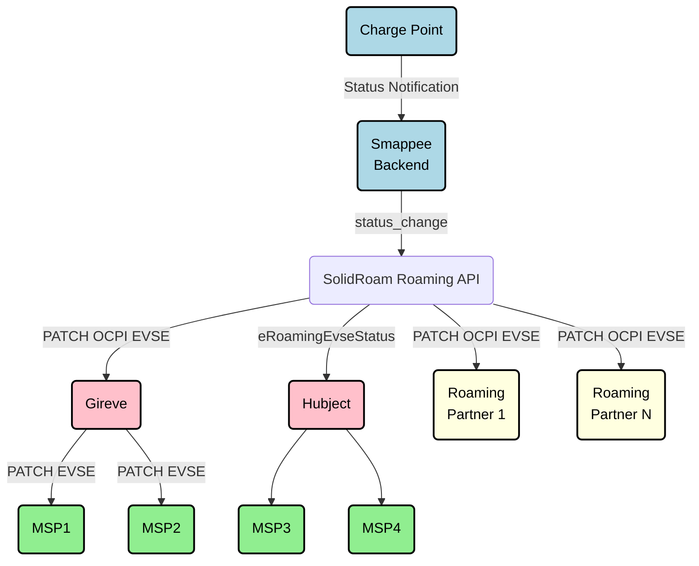

# Charge Point Status Change

```mermaid
graph TD
    CP(Charge Point) -->|Status Notification| SM(Smappee<br>Backend)
    SM -->|status_change| SR(SolidRoam Roaming API)
    SR -->|PATCH OCPI EVSE| D(Gireve)
    SR -->|eRoamingEvseStatus| H(Hubject)
    SR -->|PATCH OCPI EVSE| P(Roaming<br/>Partner 1)
    SR -->|PATCH OCPI EVSE| Q(Roaming<br/>Partner N)
    D -->|PATCH EVSE| E(MSP1)
    D -->|PATCH EVSE| F(MSP2)
    H --> G(MSP3)
    H --> I(MSP4)

    style CP fill:lightblue,stroke:black,stroke-width:2px,color:black
    style SM fill:lightblue,stroke:black,stroke-width:2px,color:black
    style D fill:pink,stroke:black,stroke-width:2px,color:black
    style E fill:lightgreen,stroke:black,stroke-width:2px,color:black
    style G fill:lightgreen,stroke:black,stroke-width:2px,color:black
    style I fill:lightgreen,stroke:black,stroke-width:2px,color:black
    style F fill:lightgreen,stroke:black,stroke-width:2px,color:black
    style H fill:pink,stroke:black,stroke-width:2px,color:black
    style P fill:lightyellow,stroke:black,stroke-width:2px,color:black
    style Q fill:lightyellow,stroke:black,stroke-width:2px,color:black
```
